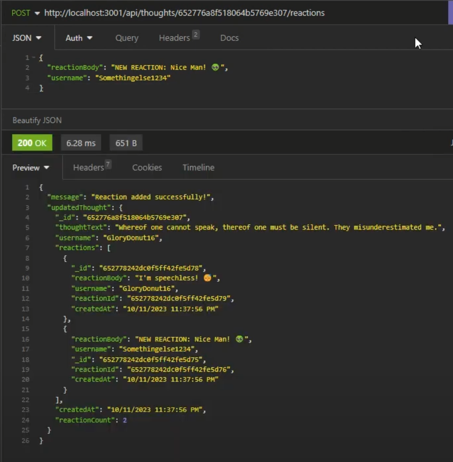

# Social Network API 

  

## Description

**Social Network API Walkthrough Video: [Social-Network-API Video Link](https://youtu.be/cfSfe3_7WBc)**

This _Back-End_ API was created for a _Social Network Web Application_ where users can share their thoughts, react to friends' thoughts, and create a friend list, and more. It uses Express.js for routing, a MongoDB database, and the Mongoose ODM. The goal is to handle large amounts of unstructured data efficiently, making it an awesome choice for social network platforms.

## Table of Contents

- [Installation](#installation)
- [Usage](#usage)
- [API Routes](#api-routes)
- [Technologies Used](#technologies-used)
- [Contributing](#contributing)
- [License](#license)
- [Credits and Questions](#credits-and-questions)
- [Application Screenshots](#application-screenshots)

## Installation

To run this application, you will need to have **MongoDB** installed on your machine.

**_Important Prerequisites:_**

> **If you do not have MongoDB installed you can follow the [MongoDB Installation Guide](https://www.mongodb.com/try/download/community) for instructions on how to install MongoDB locally.**

> **You will also need to have a tool to test API routes such as [Insomnia](https://insomnia.rest/download) or [Thunder Client](https://www.thunderclient.com/)**

After you have installed MongoDB and Insomnia or Thunder Client, you can set up the application using the following steps:

1. Clone this repository to your local machine.
2. Open a terminal in the project's root directory.
3. Run `npm install` to install the required dependencies.
4. Seed the database by running `npm run seed`.

5. Start the server by running `npm start`.

## Usage

This _Back-End_ Social Network Web API provides the following features:

1. Users can view, post, update, or delete their thoughts
2. Users can react to friends' thoughts
3. Users can create a friends list

To test these features for yourself, after performing the installation outlined in the guide, you will need to open up Insomnia or Thunder Client. These are the following routes that you will be able to use to test all of these features. Remember to run a `npm run seed` to populate your social network database before running `npm start`.

**_Here are the following routes:_**

### API Routes

- **/api/users**

  - GET all users
  - POST a new user

- **/api/users/:userId**

  - GET a single user by its `_id` and populated thought and friend data
  - PUT to update a user by its `_id`
  - DELETE to remove a user by its `_id` and associated thoughts when deleted

- **/api/users/:userId/friends/:friendId**

  - POST to add a new friend to a user's friend list
  - DELETE to remove a friend from a user's friend list

- **/api/thoughts**

  - GET to get all thoughts
  - POST to create a new thought (pushes the created thought's `_id` to the associated user's thoughts array field)

- **/api/thoughts/:thoughtId**

  - GET to get a single thought by its `_id`
  - PUT to update a thought by its `_id`
  - DELETE to remove a thought by its `_id`

- **/api/thoughts/:thoughtId/reactions**

  - POST to create a reaction stored in a single thought's reactions array field

- **/api/thoughts/:thoughtId/reactions/:reactionId**
  - DELETE to pull and remove a reaction by the reaction's `reactionId` value

## Technologies Used

- Express.js
- MongoDB
- Mongoose ODM
- Insomnia

## Contributing

To contribute to the functionality of this API follow these steps:

1. Fork the repository.
2. Create a new branch for your feature: `git checkout -b feature-name`.
3. Make your changes and commit them: `git commit -m 'Add new feature'`.
4. Push to the branch: `git push origin feature-name`.
5. Create a pull request.

## License

**This project is licensed under the MIT License**

Please refer to the LICENSE in the repository.

## Credits and Questions

**If you have any questions you may reach me at my email: [cont_rune_encoder@outlook.com](mailto:cont_rune_encoder@outlook.com)**

**Here is a link to my Github Profile: [Profile Link: rune-encoder](https://github.com/rune-encoder)**

**If you would like to check out my other projects visit this link: [Projects Link: rune-encoder](https://github.com/rune-encoder?tab=repositories)**
  

_Created By: Christian Palacios_

  

## Application Screenshots

> **Populate Database: Run `npm run seed`**  

> **GET All Users**  
> 

> **GET User by ID**  
> 

> **Create User**  
> 

> **Update User**  
> 

> **Delete User**  
> 

> **Create Friend for User**  
> 

> **Delete Friend for User**  
> 

> **GET All Thoughts**  
> 

> **Get Thought by ID**  
> 

> **Create Thought**  
> 

> **Update Thought**  
> 

> **Delete Thought**  
> 

> **Create Reaction**  
> 

> **Delete Reaction**  
> 
